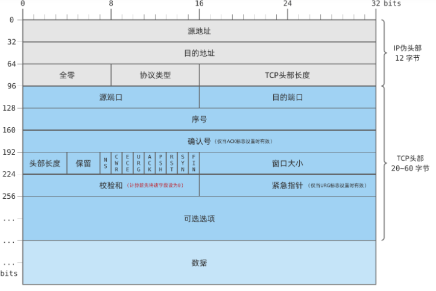
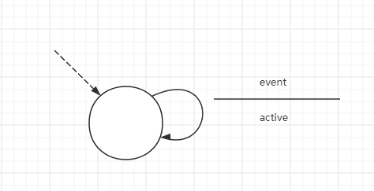

## python: 
#### 环回地址:
     数据将通过回环接口（loopback interface）发送和接收。回环接口是计算机内部的虚拟网络接口，用于在同一台计算机上的进程之间进行通信。
    环回地址只是用于本地进程通讯

#### 套接字：
        保存了进程所需网络的状态和数据结构，为应用程序提供了API进行网络通讯，对套接字操作时触发系统调用，操作系统进行网络通讯
#### 套接字类型:
- AF_PACKET 是一个直接连接网络设备的低层级接口。
- AF_HYPERV是一种地址族，用于与Hyper-V虚拟化平台通信。在Python的socket模块中，AF_HYPERV用于创建与Hyper-V之间的通信套接字。Hyper-V是微软的虚拟化平台，允许在Windows操作系统上创建和管理虚拟机。通过AF_HYPERV地址族，可以实现主机与虚拟机之间的通信，以及虚拟机之间的通信。
- AF_NETLINK 与内核通讯的地址簇
#### 其他:
- socket.ioctl 用于执行套接字的 I/O 控制操作
- socket.getaddrinfo    将地址和port等socket信息转换转换为
- Python的沙盒逃逸是指攻击者通过利用Python解释器中的漏洞或不安全的特性,执行未经授权的操作或者获取系统权限。 exec() 或 eval()

## 代理:
- SAN（Subject Alternative Name）证书是一种用于安全通信的数字证书，它可以为单个证书绑定多个域名或主机名
- CNAME 将域名指向另一个域名
- 缓存侦测
**Dos攻击(Denial of Service，拒绝服务)**:
- 攻击是一种旨在使计算机或网络资源不可用的恶意行为。攻击者通过发送大量无效请求或消耗资源来使目标系统瘫痪，导致合法用户无法访问服务。
- 分布式拒绝服务攻击（DDoS）：使用多个计算机或僵尸网络同时发起攻击，造成更大规模的资源耗尽和带宽耗尽。
_常见的DOS攻击手段_:
- ICMP洪泛攻击（Ping of Death）：发送超大ICMP数据包或大量ICMP请求，导致目标系统资源耗尽或崩溃。
- SYN洪泛攻击：发送大量TCP连接请求（SYN包），但不完成握手，导致目标系统的半连接队列被占满，无法处理新的连接请求。
- UDP洪泛攻击：发送大量伪造的UDP包，占用目标系统的带宽和资源。
- HTTP洪泛攻击：发送大量HTTP请求，占用目标服务器的处理能力和带宽。
- 慢速攻击：发送慢速HTTP请求或数据包，持续占用服务器资源，使其无法响应其他请求。
_防御措施_:
- 网络层防护：
    - 防火墙：配置防火墙规则，限制和过滤恶意流量。
    - 入侵检测和防御系统（IDS/IPS）：实时监控和检测异常流量，阻止潜在的攻击。
    - 反向代理：使用反向代理服务器分担和过滤流量，保护后端服务器。
- 应用层防护：
    - 限流和速率限制：设置请求速率限制，防止单一IP地址发送过多请求。
    - 验证机制：使用验证码、身份验证等机制，防止自动化攻击。
    - 请求队列：管理和优化请求处理队列，避免资源被耗尽。
- 分布式防护：
    - 内容分发网络（CDN）：使用CDN分散和缓存流量，减轻源服务器的压力。
    - 负载均衡：分配流量到多个服务器，防止单点过载。
    DDoS防护服务：使用专业的DDoS防护服务（如Cloudflare、Akamai等）进行流量清洗和防护。
- 监控和响应：
    - 实时监控：使用监控工具实时监控流量和系统性能，及时发现异常。
    - 应急响应计划：制定和演练应急响应计划，快速应对和恢复服务。
## 渗透
**信息收集**：
    - 基本信息: ip、域名、网段、端口
    - 系统信息:操作系统及其版本
    - 应用信息:所在端口
    - 服务信息: 高危服务，如文件共享服务
    - 人员信息: 域注册，管理
绕过CDN获取网站真实IP:
    - 通过内部邮箱

**漏洞探测**:
### 提权漏洞：
- 操作系统漏洞:
    1. 缓冲区溢出漏洞
    1. 特权提升漏洞
- 应用程序漏洞:
    1. 目录遍历漏洞
    1. 代码注入漏洞

**漏洞验证**:
    在模拟环境下测试，成功后应用与目标
**信息分析**：
    - 绕过检测机制、

**获取所需信息**：
    - 拓扑结构
    - 权限维持
    
站点下的常有文件:
- robots.txt  告诉爬虫哪些可以抓取，哪些不该
- crossdomain.xml  跨域策略
- sitemap.xml  网站结构化信息
- xx.tar.gz  用于传输的备份
- xx.bak    用于备份

**浏览器技巧**:
1. [link] [site] :domain [key] [inurl]   搜索此域名的所有网页  
###### 前缀:
- link 包含此链接的网页 
- related 相似链接
- intitle 标题为指定内容
###### 后缀:
- key 包含关键字   
- inurl  url中包含路径
- inurl:"nph-proxy.cgi" "Start browsing" 查找代理服务器
1. 快照：
    浏览器保存之前的页面

**钓鱼**:
- exe 文件混淆  通过编程在文件名中插入特殊unicode 字符
- RAR 自解压和加密传输逃避检查  https://github.com/WyAtu/CVE-2018-20250
- 利用MSF生成
- 利用CHM生成
- DDE（Dynamic Data Exchange）是一种Windows系统中用于应用程序之间进行数据交换的机制

"内部线束": 通常指的是软件中的一种技术，用于将特定功能或模块封装在一个单独的部分中，使得它们可以被轻松地调用和重用，而不必暴露给外部

### 数据格式和性质:
- **HTTP1.1** : 采用持续链接,即响应HTML后不关闭连接，继续发完结构中的内容
- **HTTP2.0**： 打开多个并行的TCP链接(单一持续的TCP链接)，解决队首阻塞的问题；性质: 成帧，多个对象分为多个帧，对象之间相互交错发送报文
- **SMTP(25)**：基于TCP的简单邮件传输协议
    命令:HELLO、MAIL FROM、REPT TO、DATA、QUIT

       用户代理 -> 邮件服务器（报文队列） -> 对方邮件服务器(邮箱) -> 目标用户
        
    - 用户代理将SMTP格式的文本交给邮件服务器处理，就不用与目标服务器对话
    每个报文内容以<CR><LF>.<CR><LF> 结束

    - 邮件内容被限制为用ASCLL码表示；现在发送邮件前会将媒体内容编码为ASCLL。
    邮箱服务器之间时没有中间服务器的，一对一发送。
    
**邮件报文格式**: 
- 由RFC 5322定义与SMTP命令不同;必须包含FROM : 和 TO :
- 现代常用方式是邮件服务器同时具有HTTP(将邮件发送/接受给客户端)和SMTP接口(发送接收/SMTP服务器邮件)

## DNS(53)基于UPD协议:
- 分层的分布式数据库
- 能使主机查询分布式数据库的应用层协议
- DNS通常是运行BIND软件的UNIX服务器
- 通常由其他协议所使用，如HTTP和SMTP
- DNS客户端和服务端
**用法**:
1. 主机别名
1. 邮件服务器别名
1. 负载分配
**分层服务器**:
- 根服务器
- 顶级域服务器
- 权威域服务器
- 本地DNS服务器 ISP的临近DNS
- 递归查询(获取下一个DNS返回的IP)、迭代查询(根据获取的DNS查询下一阶的DNS)

**DNS记录和报文**:
- 资源记录(RR): (Name, Value, Type, TTL)
- MX 邮件服务器别名，MX允许其他服务器和邮件服务器有相同别名，其他服务器应该用CNAME选择别名。
         条目格式: example.com. mail.example.com. MX
- SPF（Sender Policy Framework）是一种用于防止电子邮件地址伪造的技术，通过验证发件人的IP地址是否被授权发送电子邮件，从而减少垃圾邮件和欺诈邮件的发送。 
         条目格式: v=spf1 ip4:192.0.2.0/24 mx -all
    1. 软拒绝，仅仅标识为垃圾软件，根据邮件服务器的厂商也会有不同变化
    2. 地址范围过大就可以通过社会工程学获取一台主机发送
- A记录（Address Record）是一种DNS记录类型，用于将域名解析为IPv4地址
         条目格式: <域名> IN A <IPv4地址>
- NS (aa.com b.aa.com NS)  知道该域名权威DNS的记录，用于沿着查链连来路由DNS。
- TXT记录是一种DNS记录类型，用于存储文本信息。TXT记录可以包含任意文本信息，通常用于存储与域名相关的元数据、验证信息、安全策略等。
         条目格式: <域名> IN TXT "<文本信息>"
- DKIM（DomainKeys Identified Mail）是一种用于验证电子邮件的完整性和真实性的技术。通过DKIM，发件人可以将一个加密的数字签名附加到发送的电子邮件中，接收方可以使用公钥来验证该签名，以确认邮件的来源和完整性。
- eml中 FROM 和 TO 字段是为了显示的  sender是实际发送者

- 权威服务器应具有一条A记录;如果不是权威服务器，应具有一条NS记录(指向下一级DNS域)和A记录(下一级DNS的IP)

**报文格式**:
- 只有响应和请求报文，且报文格式相同
- 首部区域:
    

    1. 16 byte 标识符响应报文复制该请求报文标识符

    2. 1 byte  (查询/响应:0/1) 
        当时权威服务器时响应置  1
        执行递归查询   1
        响应递归可用  1

    3. 后四个字段表示体中对应的条目数量

- 问题区域:
    1. 被查询的主机名字
    2. 查询类型
- 回答区域:
    1. 最初的名字的资源记录RR

- 权威区域:
    包含其他权威DNS的记录

- 附加信息区域:
    例如MX类型请求，附加区域会包含其别名的IP

**DNS数据库中插入记录**:
- 注册登记机构:验证该域名的唯一性，将该域名插入DNS数据库
- ICANN:向各种注册登记机构授权
- 向权威服务器提交 NS 和 A记录(对于权威服务器)
- 确保WEB服务器的A记录和邮件服务器的MX记录输入权威DNS中（直到最近每台DNS都是静态配置的）
- 例如请求 www.aa.com会从本地DNS中查询权威服务器，TLD包含A记录和NS记录，返回TLD的IP，（因为已经注册了www和mail域）通过权威服务器返回www的IP
- 大部分DNS查询都绕过了根服务器

**网络设备**:
- Bridge:
        数据链路层
        连接将两个或多个不同网段的网络，并学习MAC地址来进行转发
**虚拟网络接口**:
- Bounds: 是指将多个物理网络接口绑定在一起，形成一个逻辑接口的网络配置
- VETH： 设备是一个本地以太网隧道（tunnel），该类设备总是成对创建。namespace 之间进行通信时，可以使用 VETH

- NAT（Network Address Translation，网络地址转换）是一种在计算机网络中常用的技术，用于将一个 IP 地址空间映射到另一个 IP 地址空间。NAT 最常见的用途是将一个局域网内的多个设备共享一个公共 IP 地址以访问 Internet。

- 当在 NAT 模式下运行时，WSL（Windows Subsystem for Linux）的虚拟网络接口会被映射到虚拟机管理程序（如 Hyper-V）的 NAT 网关。因此，虚拟接口无法直接ping到自己映射的网络接口，因为它们实际上是处于不同的网络上，需要经过 NAT 转换才能进行通信

## 网络中的网络:
- 端系统经过一个接入ISP与因特网相连，接入ISP与上层的区域ISP链接，这就形成了客户上-服务商
- IXP英特网交换点，多个ISP能够在这里一起对等
#### 分组交换中的时延:

- 排队时延
- 节点处理时延
- 传输时延: 数据长度/信道速率
- 传播时延:
- 总时延 = 以上时延相加
- 往返时延 RTT
- 利用率: 忙时间/忙时间+空闲时间
#### wireless network:
特征；
- 电磁波穿过物体时强度将减弱
- 在同一频段发送信号的电磁源将被相互干扰，和环境中的电磁波噪声页会形成干扰。
- 多路径传播:电磁波受到反射，接收方的信号变得模糊
**信噪比(SNR)**:
- 单位:分贝(dB)

#### 基站:
- 在网络中没有明确对应的设备，在无线网络与基站相关联中指的是:
    - 在基站的无线范围内
    - 将所关联的无线主机中继到更大的网络中
###### 基础设施模式（Infrastructure Mode：
- 所有无线设备,都通过一个中央的无线接入点（AP）进行通信。AP负责管理网络中的通信流量，并提供对有线网络的访问。
- 接入点可以通过连接到有线网络或其他接入点来扩展无线网络的覆盖范围。
###### 点对点模式(Ad hoc)：
- 设备之间直接通信，没有固定的接入点。
- 所有无线设备都可以直接相互通信，无需通过中央接入点。

#### 分类:
- 跳数
- 是否有如基站的基础设施
**单跳 基于基础设施**:，如在咖啡馆或教室等与无线主机通讯的网络，如801.11和4G LTE
**单跳 无基础设施**:单跳中的网络节点可以协调其他节点传输,如蓝牙和无线键盘。
**多跳 基于基础设施**:基站以有线的方式与较大的网络相连。某些无线节点为了与该基站相连，需要通过其他无线节点中继。无线传感网络(智能家居)和无线网状网络
**多跳 无基础设施**:在无线节点之间中继报文，移动自组织网络或车载自组织网络 如
- 紧急救援：救援人员携带的通信设备（如手持无线电或智能手机）自动发现并连接，形成网络。

## 传输层协议：
**多路分解**:将传输层收到的报文段交付到正确的套接字
**多路复用**:从不同套接字中收集数据块，并为每个数据块封装首部信息传递到网络层 
**UDP**:
                  0      7 8     15 16    23 24    31
                 +--------+--------+--------+--------+
                 |     Source      |   Destination   |
                 |      Port       |      Port       |
                 +--------+--------+--------+--------+
                 | (header+body)   |                 |
                 |     Length      |    Checksum     |
                 +--------+--------+--------+--------+
                 |
                 |          data octets ...
                 +---------------- ...

                      User Datagram Header Format
- 校验和计算:
- 发送方：
    - 将伪头部、UDP头部和数据部分拼接在一起，形成一个连续的字节序列。计算和字段初始为全0
    - 按16位相加，溢出部分回卷(加到低位)
    - 取反，放到校验和部分
- 接收方：
    - 接受完数据后将提取校验和字段后将设置为全0
        - 按照相同的顺序计算，最后和接收到的校验和比对
        - 或者将所有数据相加包括校验和，结果应为全1
## 可靠传输(RDT):
- 要点:
    - 校验和：检测传输分组中的比特错误
    - 肯定: 确认接收方已经收到分组
    - 否定：确认接收方没有收到分组，选择重传或回退N次重传
    - 定时器： 定时器超时事件
    - 序列号： 接收方确认分组时，发送方需要知道该分组是否已经收到
    - 窗口，流水线: 接收方缓存分组，发送方发送多个分组
- 口述报文协议使用肯定确认和否定确认(请重复一遍)，基于这样的重传机制的可靠传输协议称为 自动重传请求(ARQ)协议
- 需要额外的字节实现功能:
    - 差错检测
    - 接受方反馈
        - 肯定确认(ACK) 否定确认(NAK)
    - 重传
- 停等协议:
    - 当发送方等待接收方发送响应直到是ACK期间不能继续发送下一报文
- 确认报文可能会有差错:
    - 增加"听不清重新说状态"
    - 增加校验和字段
    - 发送方重传分组
- 一种简单的解决办法(TCP也在用)：
    - 在数据分组中添加一个新字段，发送方对其编号
- 冗余数据分组:
    - 当发送方一段时间内没有接受到响应，无论是响应丢失还是其他的，都会重新发送报文段
- rdt3.0: 比特交替协议，序列号在0、1交替
- 从发送方在接收方响应之前发送多个报文，这种技术被称为流水线技术。
  - 需要为每个分组增加序列号
  - 接收方和发送方不得不缓存分组
  - 差错恢复方法: 回退N步，选择重传
**GBN滑动窗口协议**:
- 发送方和接收方都维护一个滑动窗口，窗口大小为W
- 发送方在窗口中发送报文，接收方确认
发送方的事件:
- 上层调用send，当窗口满时缓存该数据或使用同步机制或信号量允许上层发送数据
- 接收ACK，对序号为n的分组采用累计确认，表明接收方已经收到n之前的所有分组
- 超时事件
接收方：
- 将序号为n的分组交给上层，这自然表示n之前的分组也被确认
**重传(SR)**:
- 发送方在超时事件发生后，将所有未确认的分组重新发送
- 接收方缓存所有失序分组，直到收到序号最小的分组在将失序分组交给上层
#### TCP:
- 没有NAK
- 面向连接,指的是在发送实际数据之前，需要相互握手建立连接确定数据传输的参数如窗口大小
- 共同状态仅保留在端系统中
- 全双工服务
- 当数据通过套接字时，就交由TCP控制了
- TCP将数据引导到该链接的发送缓冲区，然后TCP将数据从发送缓冲区复制到TCP的发送队列中
- 发送方和接收方都有一个缓冲区
- 取出和放入的数据数量由受限于最大报文段长度(MSS)，是应用层数据的最大长度，而不是包括TCP首部报文段的最大长度
- 通常根据本地最大链路传输单元(MTU)来设置MSS
- MTU是网络层的概念，指的是网络接口能够传输的最大数据包大小，包括IP头部。
- MSS是传输层（TCP）的概念，指的是TCP数据段的最大大小，不包括IP和TCP头部。
- MSS = MTU - IP头部长度 - TCP头部长度
- 路径MTU是指从发送方到接收方的链路中MTU的最小值
**冗余ACK**:
- 当发送方接受到多个相同的ACK代表一种指示
- TCP触发快速重传，在该最低端报文超时之前立即发重传

**报文结构**:

- 标志位:
    - ACK: 确认号字段有效，该报文段是对确认号字段的响应
    - PSH： 接收方应该立即将数据交给上层
    - URG： 紧急指针字段有效，该报文段是对紧急指针字段的响应
    - RST： 连接重置
- 报文段的序号是由分组首字节在整个数据中的偏移量，而非发送报文段的序号
- 确认号填充的是期望收到的下一个报文段的序号
- 提供累计确认，如果只收到了1，3，5则先请求2再请求4
- 序号可以随意。如果先前的连接的报文还在路上，序号会重复
- 捎带：客户端到服务端的确认被捎带到了服务端到客户端的确认中
- 当确认报文中没有数据时表示没有被客户端到服务端的报文捎带
- 最后的报文虽然也带有序号
**往返事件与超时**：
- 样本RTT：报文段从发送到接收的时间，对某一时刻做一次测量，仅为发送而未被确认的报文段测量
- 典型RTT：平均值，测量了所有报文段的RTT，获得一新的RTT时就会进行一次测量
    - Esitimate RTT = (1-a) * Esitimate RTT + a * RTT  a的推荐值为0.125
- 指数加权移动平均
- DevRTT: 估算SRTT和Esitimate RTT的偏差
    - DevRTT = (1-b) * DevRTT + b * |Esitimate RTT - SRTT|  b的推荐值为0.25
- 设置超时重传时间：
    - 在EsitimateRTT上加上一个余量
    - 超时时间 = EsitimateRTT + 4 * DevRTT
    - 推荐初始值为1秒
- 有些版本的TCP由隐士NAK机制，当对一个报文接受到3个ACK时，自动对后面未确认报文作NAK
- 标准TCP选择GBN，修改意见为选择重传，用字段表示SACK，发送缺失报文，每个SACK块包含两个32位的字段，分别表示成功接收的连续数据段的左边界和右边界。
**SYN泛红攻击**
- 攻击者利用在3次握手连接之前创建缓存和变量，然后发送大量SYN请求，导致服务器资源耗尽
- 解决办法：SYNcookie:
    - 在创建连接前不分配资源
    - 生成一个初始TCP序列号，SYN报文段的源和目的IP地址，源端口和目的端口以及一个散列函数，该序号就作为cooki。服务器发送具有着这种特殊初始序列号的SYNACK
    - 客户端收到SYNACK后，将cookie和序列号发送给服务器，因为没有记忆，所以服务器将收到的ACK进行散列计算并+1，如果和cookie匹配，则接受连接
    - 如果客户端没有发送ACK，则对服务器没有危害

**nmap**:
- 源从目标主机接收到SYN报文，意味着目标主机有一个应用程序使用TCP端口运行
- 返回RST 意味着没有运行，但没有防火墙阻挡
- 什么也没收到：SYN报文被防火墙阻挡
**TCP连接管理**:
- 发送方发送一个不含数据SYN标志位置1，ACK为0，随机的序号位的特殊报文
- 接收方收到SYN报文后，创建缓存和变量，发送SYN: SYN标志位置1，确认号置为client_seq + 1, 服务器的随机序号位
- 发送方收到SYN报文后，创建缓存和变量，SYN置0，发送ACK: ACK标志位置1，确认号置为server_seq + 1, client+1的序号位
**连接终止**:
- 客户端发送FIN置1的报文
- 服务器发送ACK报文
- 服务器发送FIN置1的报文
- 客户端发送ACK报文
**TCP状态转换**:
- 客户端
CLOSE (客户端发起TCP连接，发送SYN) -> SYN_SEND (服务器响应SYN，发送ACK) -> ESTABLISHED(连接建立) -> FIN_WAIT1(客户端发送FIN，等待服务器确认) -> FIN_WAIT2(服务器发送ACK，等待客户端确认) -> TIME_WAIT(等待30秒后关闭连接) -> CLOSE
- 服务器端:
CLOSE (服务器应用程序创建监听套接字) -> LIEN (服务器监听客户端的连接请求) -> SYN_RCVD(服务器收到SYN，发送ACK) -> ESTABLISHED(接收FIN，发送ACK) -> CLOSE_WAIT(等待客户端确认) -> LAST_ACK(服务器发送FIN，等待ACK) -> TIME_WAIT
#### 防火墙:
目标:
- 内外部的流量都通过防火墙
- 仅被授权(本地策略定义)的流量通过
- 防火墙自身免于渗透
经常在路由器上实现并使用SDN远程控制
分类:
- 传统分组过滤器(TPF)
    - 独立的检查每个数据报，可以根据以下因素决定丢弃还是允许
    - 源和目标IP
    - IP数据报中的协议
    - TCP标志
    - ICMP报文类型
    - 数据包离开和进入的不同规则
    - 对路由器接口的不同规则
- 策略:
    - 无WEB访问 丢弃所有IP、端口到80的出分组
    - 无入TCP连接但只能访问机构公共服务器  丢弃所有除到该服务器、端口80的任何IP地址的入TCP SYN分组
    - WEB无线电耗尽所有带宽   丢弃所有UDP分组
    - 防止网络被用于smurf Dos攻击:
        - 攻击者伪造成目标IP地址广播ICMP数据包，系统内的所有主机将响应目标主机
        - 丢弃所有广播ICMP
    - 防止网络被跟踪： 丢弃所有ICMP TTL过期分组，因为过期之后会返回响应给源主机
    - 无法保护伪造IP分组
    - 内部访问外部而外部连接内部，过滤所有ACK为0的入分组
- 状态过滤器(SF)：
    - 维护连接表和控制状态表，当内部访问外部时主动发起SYN报文，防火墙记录此连接，当外部返回ACK时允许通过，如果外部发起ACK为1的报文，因为连接表没有建立此次连接，则丢弃该分组
    - 状态过滤器(SF)根据TCP连接的状态来决定是否允许分组通过
    - TPF不能过滤ACK为1的分组，攻击者可以用异常分组来崩溃内部系统，执行拒绝服务攻击，绘制内部网络
    - 可以观察TCP的连接状态，当建立连接后60秒内没有数据传输，则假设当前数据传输结束，关闭连接

- 应用程序网关(AG)

#### Telnet:
- 远程登录的应用层协议
- telnet没有加密
##### 有限状态机(FSM):

虚线初始状态
- 扩展FSM: 事件和活动用特定的编程语言表示

## API 文档:
Python API :https://docs.python.org/zh-cn/3/library
RAR:https://research.checkpoint.com/2019/extracting-code-execution-from-winrar/
SPF测试: https://www.kitterman.com/spf/validate.html
