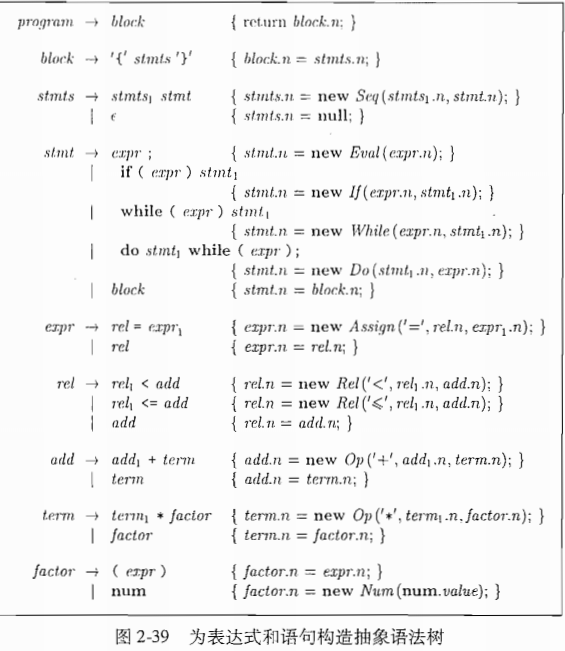

# 表达式:

---

## 静态检查
在编译过车中完成各种一致性检查:
- 语法检查:如任何作用域内同有个标识最多只能声名一次
- 类型检查: 操作符是否可以操作其类型的值
    - 自动类型转换
    - 重载: 如果一个符号在不同的上下文中有不同的含义，比如 "+"在java中做整形或字符串拼接

## 左值和右值
      a      =       1 
      左值  assign  右值

## 三地址码
具有如下形式:

      x = y op z

- 控制程序流

      ifFalse x goto L   如果x为false 跳转L
      goto L              无条件跳转

## 表达式的翻译 
为一个表达式的语法中每个运算符都生成一个三地址指令既

a = x + y - z  
可以翻译成:\
t1 =   x + y\
t2 = t1 + z

但需要注意运算顺序和表达式出现在左值和右值的语义如 :
- 数组 a[1] 出现在左值时是赋值，右值为取值 

